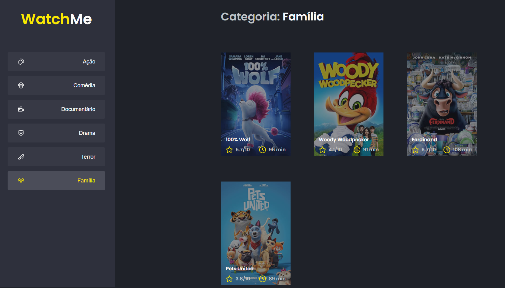

  

	
  
  
  
   
  
  

# 📖 About

This application is the second challenge from the [Ignite Bootcamp](https://rocketseat.com.br/ignite). The objective to make the componentization of the this app.

# 📐 Layout

  

    
  

### 🚀 Tecnologies

- React.js
- Typescript
- SCSS
- HTML
- JSON Server

# 🔧 How to run

- Download this project to your computer or use the git command `git clone git@github.com:dioverde-dev/Ignite-Desafio-02.git`
- Open the folder Ignite-Desafio-02 in your system's shell
- Run `$ yarn install` to install the project's modules

### Webpage

- Open the folder Ignite-Desafio-02 in a terminal tab
- Run `$ yarn dev` to app.
- Run `$ yarn server` to use fake api.

# :closed_book: License

Released in 2021 :closed_book: License

This project is under the [MIT license](./LICENSE).

Give a ⭐️ if this project helped you!

#

   <b> &#60;/&#62; by <a href="https://www.linkedin.com/in/dionisiodoliveira/">Dionisio D. Oliveira</a></b>

